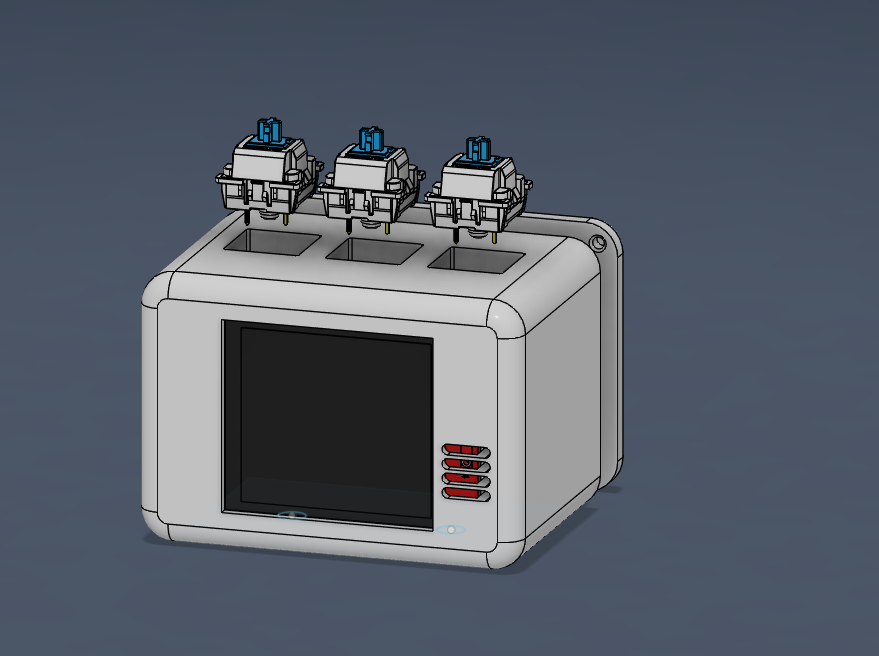

day 1 4/27/2026 - cadding
time tracked 1 hr

so i decided i want a small music hub and i love the idea of it so i decided to follor the gudided project ins tassis
i am amster of cad heheheh so this was easy
i first started by importing the screen 
then i start sketching it out i was having a rought time getting it centered so i had to do some math and i wanted the screen to not have any bezels and not be ugly so i had to get it back make thin walls
then i made it centerd then i went ahead by felling the corners which gave me trouble later i went ahead and i imported the esp 32 moduleand started making a lil area for it after that i got in the switches a dxf file was added to help me sketch it out and i made connecters for the back its snap fit so should be snap then i made screw mountings for the screen and i am so happy with how it came out but its not done  bye